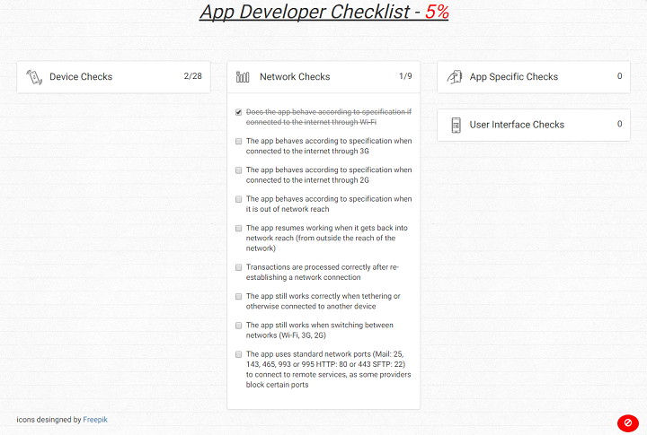

# Mobile App  Developer Checklist

The mobile ap developer checklist is a simple web app meant to be used by mobile app developers for quality assurance purposes. A demo of the app can be viewed [here](http://checklist.adriangordon.me).



## Adding Checks and Sections
All of the sections and checks being displayed in the list are being pulled from the *checklist.json* file in the project root. To add either a section or check to the list, simply fork the project and add the additional data to the *checklist.json* file using the format below.

e.g.

```
{
  "sectionTitle":"Section Name",
  "sectionAlias":"section_name",
  "thumbnail":"link/to/section/thimbnail.png",
  "checks_completed":"0",
  "checks":[
    {
      "description":"check_description_text",
      "value":false,
      "links":[]
    }
  ]
}

```

*If you have ideas for useful new checks, or would like to help maintain/improve the project, feel free to create an issue and/or submit a pull request -  don't be shy ;)*
